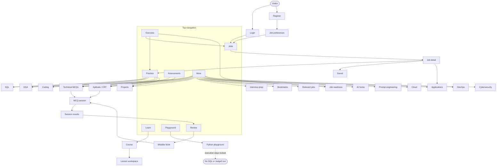
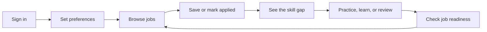
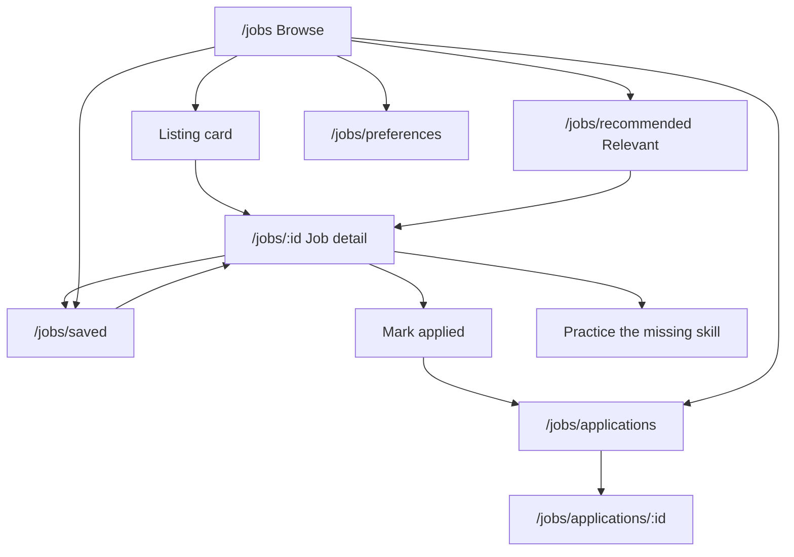
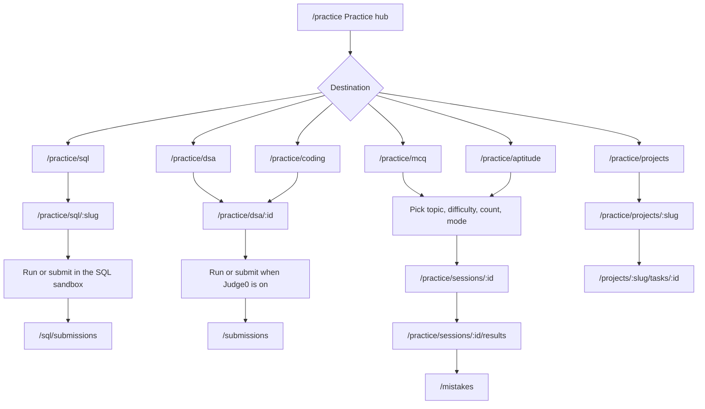
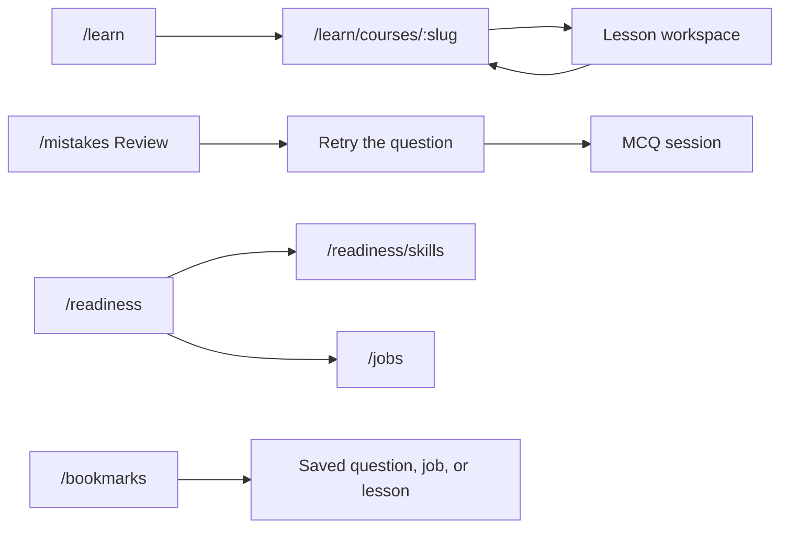
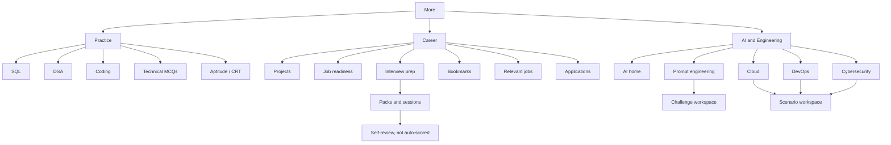
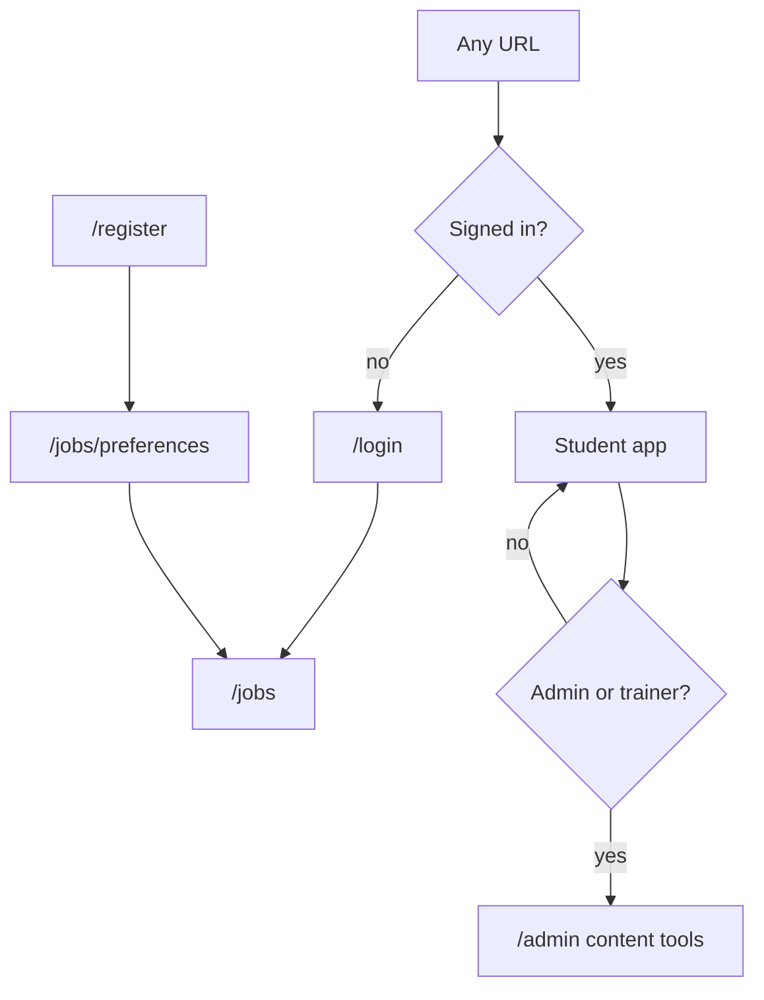

# JobReady main product flow

This is the live student product after the frontend merge. It shows where each primary screen goes. It does not list every admin form or every AI / Cloud / DevOps sub-track.

Open this file in a Mermaid preview. Start with the map below.

## 1. Product map

## 2. How a student moves

The product is jobs-first. Practice, learn, and review exist to get the student ready for a role, then back to a job.

## 3. Jobs

Jobs is the home after login. The other job screens hang off one listing, not off the top bar.

Filters on Browse (family, search, sort, pagination) stay on `/jobs`. They are not separate products.

## 4. Practice and assessments

Practice is the catalog. Assessments is the timed / scored path. SQL, DSA, and Coding are workbenches, not MCQ sessions.

Assessments in the top bar opens Aptitude. Technical MCQs uses the same session engine. Playground (`/practice/python`) is a separate scratch pad and does not start a session.

## 5. Learn, review, and readiness

## 6. More menu

More is not a second product. It is the rest of the same map, grouped so it is not one long list.

AI, Cloud, DevOps, and Cybersecurity each open a home, then a track, then a scenario or challenge. Those tracks are inside the home. They are not extra top-bar items.

## 7. Who can enter

Admin is a content desk behind the same login. It is not part of the student path.

## What this map leaves out

- Admin editors for questions, SQL, coding, jobs, courses, prompts, and scenarios.
- Every AI, Cloud, DevOps, and Cybersecurity sub-track. They live under that home.
- Placeholder routes that are not in the top bar or More menu.
